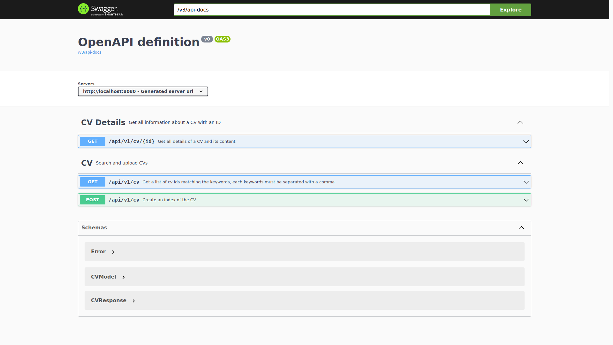
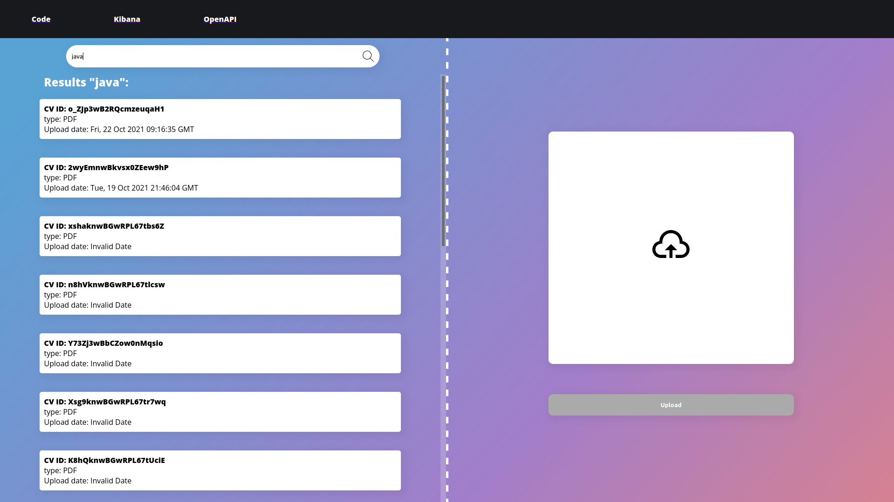

# CV Indexing
[](https://circleci.com/gh/alexandre-em/CVIndexing/tree/master)

CV Indexing is an API developed in java spring boot, with the elk stack (elasticsearch, kibana, logstash). 
It allows the user to upload then index __*.doc, *.docx and *.pdf__ CV files to elastic search and to search CVs matching
keywords.

### Group members:
* **Sivacoumar Silvain**
* **Bouibker Oussama**
* **Em Alexandre**

Task division [here](https://github.com/alexandre-em/CVIndexing/projects/1)

## Table of Contents
1. [Installation](#installation)
   1. [Requirements](#requirements)
   2. [Run on a local environment](#run-on-a-local-environment)
   3. [Run tests](#run-tests)
2. [Endpoints examples](#endpoints-examples)
   1. [Search Cvs by keywords](#search-cvs-by-keywords)
   2. [Search Cvs by id](#search-cv-by-id)
   3. [Index a new CV](#index-a-new-cv)
   4. [Get CV tags by Cv id](#get-cv-tags-by-cv_id)
   5. [Add tags to a cv](#add-tags-to-a-cv)
3. [OpenApi](#openapi)
4. [Kibana](#kibana)
5. [Front-end](#front-end)

## Installation
### Requirements
Install [Docker-compose](https://docs.docker.com/compose/install/), then pull and run elk images
```shell
    $ git checkout origin master # skip this if you're already on master and omit `origin` if master exist locally
    $ docker-compose up build elasticsearch kibana logstash # then wait until kibana is ready
```
Wait for the containers to be completely run (so kibana is ready at [localhost:5601](http://localhost:5601/)) 
Then install and run the app container:
```shell
    $ docker-compose up build app # run only if kibana is ready 
```
>You could run and build all with `docker-compose up -d --build`, 
but il would generate unnecessary warning/error logs while trying to run the app multiple times.
### Run on a local environment
To run on a local environment (without docker), you will have to update some configuration files:
* [logback.xml](src/main/resources/logback.xml): line 7 update to your local logstash endpoint
* [ElasticSearchConfiguration.java](src/main/java/com/indexation/cv/config/ElasticSearchConfiguration.java) line 18 & 19 update to your local elasticsearch endpoint and authentication information if you have configured one, delete line 19 if not

Then you can run the project app with:
```shell
    $ ./mvnw clean package
    $ java -jar ./target/cv-0.0.1-SNAPSHOT.jar
```
#### Environment variables (WIP)
There are also some environment variables that have a default value if not defined, for instance:
```json
  {
      "ENV_PROFILE": "dev",
      "ELASTIC_ENDPOINT": "localhost:9200"
  }
```

### Run tests
```shell
    $ docker exec -it app ./mvnw test # if you run the elk docker containers
    # or 
    $ ./mvnw test # if you run the api on a local environment
```

---
:warning: **NOTE**
Make sure to have Java installed and the JAVA_HOME environment set
---

## Endpoints examples
>Before running some calls on the API, you can run the tests to somehow generate data located at [CVWebIntegrationTest.java](src/test/java/com/indexation/cv/CVWebIntegrationTest.java)
### Search Cvs by keywords
```shell
    # Which candidates are doing Java and Node at the same time?
    $ curl "localhost:8080/api/v1/cv?keyword=java,node?match_all=true" | jq
```

>You can also add a param `match_all` which is a boolean that filter CVs by matching at least one of the keywords if `false`, 
>and matching all keywords if value to `true`. Value by default `match_all` is set to `false`. The same goes with the keyword search on the `tags` endpoint.

### Search Cv by id
```shell
    # Get details of a specific CV
    $ curl "localhost:8080/api/v1/cv/BQZt13wBU44mpGRqWCPE" | jq
```


### Index a new CV
```shell
    # Example without tags
    $ curl -X POST localhost:8080/api/v1/cv -H 'accept: application/json' -H 'Content-Type: multipart/form-data' -F 'file=@cv.pdf;type=application/pdf' | jq
    # Example with tags
    $ curl -X POST localhost:8080/api/v1/cv -H 'accept: application/json' -H 'Content-Type: multipart/form-data' -F 'file=@cv.pdf;type=application/pdf' -F "tags=java" -F "tags=node" -F "tags=python" | jq
```

### Get CV Tags by `cv_id`
```shell
    $ curl "localhost:8080/api/v1/tag/cv/JwYD2HwBU44mpGRqQ1dw" | jq
      % Total    % Received % Xferd  Average Speed   Time    Time     Time  Current
                                     Dload  Upload   Total   Spent    Left  Speed
      100   103    0   103    0     0   4120      0 --:--:-- --:--:-- --:--:--  4120
      {
        "id": "KQYD2HwBU44mpGRqRFcJ",
        "cvId": "JwYD2HwBU44mpGRqQ1dw",
        "tags": [
          "java",
          "node",
          "React",
          "Typescript"
        ]
      }
```

### Add tags to a CV
```shell
    $ curl -X PATCH "localhost:8080/api/v1/tag/cv/JwYD2HwBU44mpGRqQ1dw?tags=Spring&tags=Elasticsearch" | jq
      % Total    % Received % Xferd  Average Speed   Time    Time     Time  Current
                                       Dload  Upload   Total   Spent    Left  Speed
        100   128    0   128    0     0   1488      0 --:--:-- --:--:-- --:--:--  1505
      {
        "id": "KQYD2HwBU44mpGRqRFcJ",
        "cvId": "JwYD2HwBU44mpGRqQ1dw",
        "tags": [
          "java",
          "node",
          "React",
          "Typescript",
          "Spring",
          "Elasticsearch"
        ]
      }
```

## OpenAPI
You can also visualize how to use all endpoints with the OpenApi available at [api/apidocs.html](http://localhost:8080/apidocs.html)

All endpoints have been described with the required query's params, body, etc. and all possible response and a quick description of the reason.


## Kibana
You can access to kibana at [localhost:5601](http://localhost:5601/)
To be able to visualize the data on kibana:
```json
    {
      "username": "elastic",
      "password": "root"
    }
```


## Front-end
A very quick front-end has also been developed, using React with Typescript and an external library that allows users to drag and drop files on the upload box.
### Build and Run
```shell
    $ docker-compose up -d --build cvindexer
```
### Screenshot

